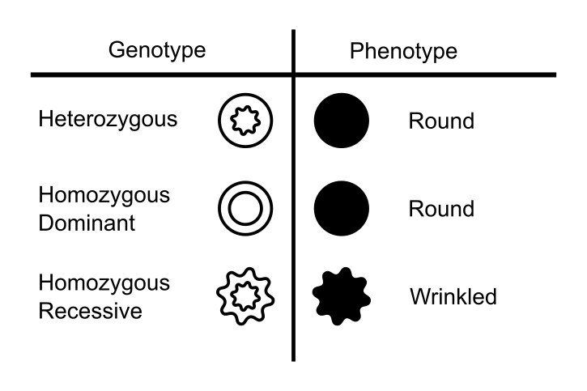

## Nuller than null: the case of Mendel and Fisher

Gregor Mendel, a monk of seemingly impeccable character, conducted his famous experiments on peas over the years from 1856 to 1863. The painstaking task of breeding thousands of plants and carefully classifying their offspring paid off when the resulting data provided evidence that genetic traits were passed on in discrete forms. Mendel's evidence was close agreement of the data from his pea plants with his theory's predictions [@Mendel:1866].

Although Mendel's work on inheritance filled a key gap in nineteenth century biological understanding, it went largely unnoticed until the turn of the twentieth century when his results were rediscovered by several biologists [@Piegorsch:1990]. The rediscovery sent ripples through the genetics community due to its theoretical importance. A small number of readers, however, noticed something else. Statistically speaking, the results were good; *surprisingly* good, in fact.

Should a good fit to a true theory be surprising? As @Pilgrim:1984 puts it, "Mendel's results agreed with his theory. Why shouldn't they, since his theory was correct?" @Fisher:1936 took a different view. He believed the results were *too* good, and that this was evidence of falsification. Even worse, Fisher suggests that this possibly "contravene[s] the weight of the evidence supplied in detail by his paper as a whole" (p. 132). This is not to say Mendel was wrong, but that his results --- which we review subsequently --- were not as evidentiary as they might initially appear.

Mendel's experiments considered seven traits of the garden pea plant. Pea plants, like all living things, have visible traits called phenotypes that are defined by genes. For instance, a pea plant's seeds might be round or wrinkled, depending on its genes. These genes come in pairs --- one from each parent --- and can be of different forms, called alleles. 

A dominant allele can override a recessive allele such that an organism with both types of allele will have the dominant trait. The round seed shape is dominant over the wrinkled shape. This means a seed with one of each allele, called heterozygous, will be round. The three possible genotypes and their corresponding phenotypes are shown in Figure \@ref(fig:MendelKey). 

```{r MendelKey, echo=FALSE, fig.cap="All possible genotypes and corresponding phenotypes for the seed shape trait. Seed shape has two possible alleles (round and wrinkled) and the round allele is dominant. Icons for the genotypes (black-and-white) and phenotypes (solid black) are shown here and used in subsequent figures. The circle denotes the round allele and the star, the wrinkled allele.", results='asis'}

```

Mendel theorised there was a 50% chance of a parent passing each of its two alleles to its offspring. This leads to easily predictable genotypic ratios for the seed shape of offspring from two heterozygous parents (shown in Figure \@ref(fig:MendelGenes)). 

```{r MendelGenes, echo=FALSE, fig.cap="An example of Mendelian genetics with two heterozygous parents (left and top of each square). Inside the squares are the four crossings of the two alleles from each parent. A: The genotype of each possible cross. B: The phenotype of each possible cross. Although 50\\% of the alleles correspond to the wrinkled phenotype, only 25\\% of the resulting plants will be wrinkled due to the wrinkled allele's recessiveness.", results='asis'}
knitr::include_graphics('../../figures/img/Fig2GeneEx.png')

```

The key to Mendel's experiments were the ratio of phenotypes from crossings of different plants. Mendel could infer that a plant was heterozygous if, as a seed, it was round, yet some of its seeds were wrinkled. Wrinkled-seed offspring are a giveaway that the parent plant must be passing on a recessive allele, and hence it *must* be heterozygous. As Figure \@ref(fig:MendelGenes) shows, if one crosses a heterozygous plant with itself, Mendel's theory predicts that 75% of the seeds should be round.

```{r mendel1, echo=FALSE, results='asis'}

Exp1 = c(.75, 7324, 5474, 5493, -19, 37.06, -0.51)
Exp2 = c(.75, 8023, 6022, 6017.25,  4.75, 38.79, 0.12)

tab = rbind(Exp1, Exp2)

colnames(tab) = c("$p$","$N$","$y$",
                  "$Np$", "$y - Np$", "$SD(y - Np)$", "$z=(y-Np)/SD(y - Np)$")
rownames(tab) = c("Shape", "Colour")

papaja::apa_table(tab, caption = "Seed totals, $N$, and counts of seeds with the dominant phenotype, $y$, for the seed shape and seed colour experiments taken from Mendel (1886); $p$ is the theoretical proportion of seeds with the dominant phenotype predicted by Mendel's theory; z is the number of theoretical standard deviations between the expected count and observed count.", digits = c(0,2,0,0,2,2,2,2))

```


Table \@ref(tab:mendel1) shows the Mendel's results from crossing heterozygous plants. Of 7324 seeds, we would expect 5493 to be round. Mendel reports that 5474 were round, only 19 round seeds from the number expected. Of course, the results of such experiments are variable: if Mendel is right, the standard deviation of the number of round seeds of 7324 is $\sqrt{7324 \times .75 \times .25} \approx 37$. Mendel's results are only half a standard deviation from the theoretical value. By itself, this closeness is not enough to raise suspicion: there would be a fair chance --- 38% --- of obtaining a closer result under Mendel's theory.


```{r MendelExperiment, echo=FALSE, fig.cap="A diagram of Mendel's first experiment which tested a single trait. The icons here denote the phenotypes (solid icons) and genotypes (black-and-white icons) for the seed shape trait. The round seed shape (denoted by the circles) is dominant and wrinkled shape (denoted by the star is recessive). Refer to Figure ? for a full description. Each stage of the experiment has two rows. The first shows the parental plants with a cross between them to indicate breeding, note that in stages one and two the plants self-fertilized. The second row shows the offspring in their theoretical ratios. The preperation stage which only used pure-breeding parents ensured 100% of plants were heterozygotes. However, in Stage 1 the geneotypic ratio could not be deduced and the phenotypic ratio, 3:1 is shown. Stage 2 shows the two possible phenotypic ratios: a homozygous dominant plant can only produce round seeds. Alternatively, a heterozygous plant will produce round and wrinkled seeds in the same ratio as in stage one. Therefore observing a wrinkled seed allowed Mendel to conclude the parent must be heterozygous."}
```

In 1936, Fisher considered all of Mendel's experiments. For every experiment, we can compute a deviation from the theoretical value, in standard errors. Because we are interested in the overall *distance* from the theoretical value, we square every deviation and sum them across all experiments. The result can be thought of as a squared distance, in standard errors, from the theoretical value. For round/wrinkled experiment considered above, we results were $z_1=.51$ standard errors below the theoretical value. In a second experiment, Mendel found that 6022 of 8023 seeds contained yellow, rather than green, seed leaves. The expected proportion was 75%, or about 6017 yellow leaves. This observation is five above what was expected, a mere $z_2=.12$ standard errors from the theoretical value.

We might think of the theoretical value like the bull's eye of a target, as shown in Figure \@ref(fig:MendelTarget)A. The natural metric of the target is given by the expected variability of the estimate of the proportion, the standard error. The figure shows the standard errors as circles around the bull's eye. To assess how close our two experiments are to the bull's eye, we work out the distance from the center to the point (.51, .12), the number of standard errors our two experiments are away from the theoretical. In the case of our two experiments, this can be found by the familiar Pythagorean theorem: $\sqrt{.28}$. 

```{r MendelTarget, echo=FALSE, fig.cap="A: Calculating the distance, in standard errors, of a pair of estimates (red circle) from the theoretical values (center of the bull's eye). Diamonds on the axes show the individual observations in each experiment. B: The distribution of the squared distance, assuming two points. The expected squared distance is 2, as shown by the triangle on the bottom axis. The probabilty of getting a smaller squared distance than the one observed is about .13, assuming Mendel's theory. The shaded region shows the middle 50% of the distribution.", fig.width=8,fig.height=4.5,cache=FALSE}
source('../../figures/Mendel_target.R', chdir = TRUE)
```

The distance by itself does not tell us whether the results are surprisingly close; to do this, Fisher compared the observed values to the sampling distribution under Mendel's theory. If Mendel was right, the squared distance for two points has a $\chi^2$ distribution with two degrees of freedom, as shown in Figure \@ref(fig:MendelTarget)B. For each dimension (here, seed shape and color) we expect to be somewhat off center. The more dimensions the greater the expected distance, because each dimension contributes to the distance from the center. The expected squared distance for two experiments is 2 (these are the degrees of freedom of the $\chi^2$). The *observed* squared distance is much smaller: .28. Our observed distance from the bull's eye is closer than what we would expect 87% of the time, if Mendel's theory is correct. While far from definitive, this seems close enough to cause some suspicion. But this analysis only includes two of the 84 experiments reported by Mendel.

```{r MendelChi216,echo=FALSE, fig.cap="Results from Edwards' (1986) sixteen groupings of Mendel's 84 experiments, along with theoretical distributions. The series are sorted by deviation from expectation, and scaled by expectation (degrees of freedom) in order to visually align all the results. Shaded regions show the middle 50% of the distributions.", fig.height=8,fig.width=5, cache=FALSE}
source('../../figures/Mendel_16.R', chdir = TRUE)
```


```{r MendelChi2DF84, echo=FALSE, fig.cap="Theoretical distribution across all 84 experiments. The red line indicates the observed total squared distance 49.15 (calculated from Edwards' 1986 data). There is a 99.9% chance that a random value from this distribution would be larger than 49.15. The shaded region shows the middle 50% of the distribution and its expectation is indicated by the triangle on the bottom axis.", cache=FALSE}
source('../../figures/plot.chi2.84.R', chdir = TRUE)
```


Fisher tabulated the results of all 84 Mendel's experiments. For clarity of presentation, in Figure \@ref(fig:MendelChi216) we have grouped the related results into the 16 series suggested by @Edwards:1986 (Table 2, pp. 306-308), ranging from 2 to 20 degrees of freedom.[^24] Notice how most of the squared distances from the theoretical predictions seem to be on the low side, closer to 0 than what we would expect. Across all 84 of Mendel's experiments, we would expect on average a squared distance of 84. The observed squared distance is substantially less: `r round(obs.X2,3)`. To understand how small this value is, Figure \@ref(fig:MendelChi2DF84) shows a $\chi^2$ distribution with 84 degrees of freedom, the sampling distribution of the squared distance across all experiments assuming Mendel's theory. The observed distance is so small that we would expect 99.9% of such sets of experiments to yield a larger distance. The experiments are *very close* to the theoretical values.

[^24]: The two experiments we considered are series 1 in Figure \@ref(fig:MendelChi216). The results are not exactly the same as shown in Figure \@ref(fig:MendelTarget)B due to the fact that Edwards (1986) has removed data that were used in another series in order to make the data in each experiment independent from the others. This also causes the overall test of all 84 experiments to be different from that computed by Fisher, but the difference does not affect the conclusions. See Edwards (1986) pp. 299-300.

So what? Is @Weldon:1902 right when he says that Mendel's results "admirably in accord with his experiment" (p. 235)? Is @Pilgrim:1984 right to wonder what the fuss is all about that results closely agree with a theory? Or is Fisher right when he suggests that "most, if not all, of the experiments have been falsified so as to agree closely with Mendel's expectations" (1936, p. 132)? *Do results that agree too closely with a theoretical null actually undermine the evidence*?

The last prominant statistician to weigh in on the debate was Edwards (1986), who said that 

> "If it were just a question of having hit the bull's eye with a single shot we might conclude [...] that Mendel was simply lucky, but when a whole succession of shots comes close to the bull's eye we are entitled to invoke skill or some other factor." [@Edwards:1986, p. 303] 

Of course "skill" cannot overcome the problem of inherent random variability. Both Edwards[^26] and more recently @Franklin:2008 suggest that Fisher's analysis has stood the test of time: Mendel's results are too good to be true. Yet the controversy is largely unknown outside of statistical circles. Why?

**Justified suspicion that a result is tainted does not mean it is wrong.** We are in the lucky position a century and a half later of knowing that Mendel was right. Science is not always neat; biases will creep into even the most rigorous research, if only because it is scientific progress requires interpreting the results of experiments *post hoc* with incomplete information. As [@Dobzhansky:1967] wrote at the centennial of Mendel's publication,

> "Few experimenters are lucky enough to have no mistakes or accidents happen in any of their experiments, and it is only common sense to have such failures discarded. The evident danger is ascribing to mistakes and expunging from the record perfectly authentic experimental results which do not fit one's expectations." (Dobzhansky, 1967, p. 1588)

Luckily Mendel described his experiments in sufficient detail that they can be easily repeated. Doubt about any claim can be put to rest by rigorous replication of the procedure, provided that the theory is defined clearly enough to decide what a "replication" would be.

**Interpretation of results occurs in the context of scientific theory.** This seems especially obvious in the case of Mendel, given that the null was derived from Mendel's theory. But suppose Mendel were a fair-minded experimentalist, and we could travel back in time and confront him with Fisher's findings? Should Mendel abandon his theory? Probably not. Although Fisher's critique threatens the evidential force of Mendel's experiments, Fisher (1936) himself points out that Mendel, or anyone else in the nineteenth century, could have derived genetic theory from three simple postulates (1936, pp. 123-124); he also believed that Mendel may have done so. Fisher thought it possible that Mendel's experiments were a "carefully planned demonstration of his conclusions" [@Fisher:1936, p. 124], rather than their sole support.


[^26]: Interesting and relevant to the modern debate over significance testing is the fact that even the likelihoodist Edwards was persuaded by Fisher's logic, in spite of his skepticism of significance tests. He said that "[i]t may be helpful if I admit at this point that for many years I supposed that Fisher's analysis was going to be able to be faulted because of its total reliance on the 'repeated sampling' logic of the $X^2$ goodness-of-fit test which I had come to mistrust, but a complete review of the whole problem has now persuaded me that his 'abominable discovery' must stand." (1986, p. 310)


